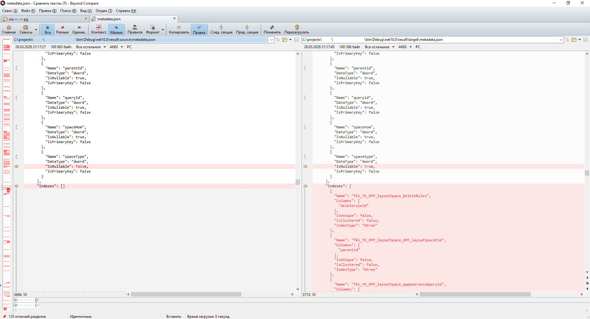

# DBMetadataComparator

Позволяет сравнивать расхождения метаданных двух БД (работает с MSSQL и Postgre)

Результат сравнения заносится в json-файлы. Сравнительный анализ проводится в утилите BeyondCompare

## Порядок работы

1. Указать строки подключения сравниваемых БД в файле настройки (connection.json)
"Db2": "User ID=postgres;Host=_my_host;Port=5432;Database=DBName1;Pooling=true;Minimum Pool Size=0;Maximum Pool Size=100;Connection Lifetime=0;",
"Db1": "Server=_my_host;Database=DBName2;User Id=sa;TrustServerCertificate=True;",

2. Для первоначального анализа лучше сделать нормализацию типов, если сравниваются mssql и postgre. Нормализация позволяет не отвлекаться на типизацию, а устранить нехватку таблиц, процедур и индексов.
"NormalizeTypes": true,
"NormalizeSchema": {
    "dbo": "DBO",
    "ora_dbo": "DBO",
    "public": "PUBLIC"
}

3. Запустить приложение, дождавшись положительного результата его работы
cd c:\users\xxx\downloads\gulf_db_compare\
start GULF_DB_COMPARE.EXE

4. В результате работы, создастся папка result, в которой будут размещены исследуемые метаданные. Сравнивать удобно с помощью утилиты Beyond Compare